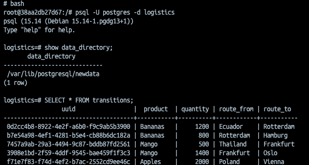

# PostgreSQL.Advanced

### Лекция 3. Настройка Postgres

```
Описание/Пошаговая инструкция выполнения домашнего задания:
*Однажды утром Алексей получил срочное сообщение от отдела логистики: "Мы не можем обновить данные о последней партии бананов, отправленной в Европу!" Оказалось, что диск виртуальной машины, где работала база данных, был заполнен на 95%. Алексей понял, что это не просто временная проблема: если данные не будут обновлены вовремя, это приведёт к задержкам поставок и штрафам от клиентов.

Причиной нехватки места стало не только увеличение объёмов данных, но и ошибка в настройках: логи транзакций (WAL-файлы) занимали слишком много места, так как никто не настроил их автоматическую очистку.
Алексей решил, что нужно не просто освободить место, но и обеспечить стабильность системы на будущее.
Он решил добавить внешний диск к виртуальной машине и перенести туда базу данных. Однако на пути к успеху его ждали новые вызовы:

Как правильно проинициализировать и подключить внешний диск?
Как перенести данные, не потеряв их?
Как настроить PostgreSQL, чтобы он работал с новым диском?
Алексей знал, что от его действий зависит успех компании: если данные будут потеряны, это приведёт к срыву поставок и недовольству клиентов.*

🎯 Задание

Повторите шаги Алексея:

Создайте виртуальную машину с Ubuntu 20.04 и установите PostgreSQL 15 или выше.
Создайте таблицу с данными о перевозках.
Добавьте внешний диск к виртуальной машине и перенесите туда базу данных.
Настройте PostgreSQL для работы с новым диском.
Проверьте, что данные сохранились и доступны.
```

### Выполнение:

Решил не делать это в облаке, но симулируем ту же процедуру используя docker

**Docker Compose**
```yaml
services:
  db:
    image: postgres:15
    container_name: pg15
    environment:
      POSTGRES_USER: postgres
      POSTGRES_PASSWORD: postgres
      POSTGRES_DB: logistics
    ports:
      - "5432:5432"
    volumes:
      - pgdata_old:/var/lib/postgresql/data
      - pgdata_new:/var/lib/postgresql/newdata
      - ./conf/postgresql.conf:/etc/postgresql/postgresql.conf:ro
    command:
      - "postgres"
      - "-c"
      - "config_file=/etc/postgresql/postgresql.conf"
volumes:
  pgdata_old:
  pgdata_new:
```

С дефолтным конфигом:
```
# Point PG at the "old disk"
data_directory = '/var/lib/postgresql/olddata'

listen_addresses = '*'
shared_buffers = '256MB'
max_wal_size = '2GB'
checkpoint_timeout = '15min'
log_checkpoints = on
```

Предварительно заполнение базы
```sql
-- Создадим синтетическую табличку перевозок
create table transitions (
    uuid uuid,
    product varchar(64),
    quantity int4,
    route_from varchar(64),
    route_to varchar(64)
);

-- Чуть чуть ее наполним
INSERT INTO transitions (uuid, product, quantity, route_from, route_to) VALUES
('0d2cc4b8-8922-4e2f-a6b0-f9c9ab5b3900', 'Bananas',      1200, 'Ecuador',     'Rotterdam'),
('b7e54a98-4ef1-4281-b5e4-cb88b6dc182a', 'Bananas',      800,  'Rotterdam',   'Hamburg'),
('7457a9ab-29a3-4494-9c87-bddb87fd2561', 'Mango',        500,  'Thailand',    'Frankfurt'),
('3908e1bd-2f59-4ddf-9545-bae459f1f3c3', 'Mango',        1400, 'Frankfurt',   'Oslo'),
('f71e7f83-f74d-4ef2-b7ac-2552cd9ee46c', 'Apples',       2000, 'Poland',      'Vienna'),
('f087aaf0-e3ff-431e-84a4-018a4a8dfc3c', 'Apples',       900,  'Vienna',      'Milan'),
('3b3847d6-2b5a-4ece-9a64-90d58bf88fec', 'Pineapple',    700,  'Costa Rica',  'Lisbon'),
('1396fe2e-8b37-46ed-9db7-f8df39e50afc', 'Pineapple',    1100, 'Lisbon',      'Madrid'),
('aa675720-27e4-4fc8-8627-63918bb5cbcd', 'Oranges',      600,  'Morocco',     'Paris'),
('84ce3f45-a7f8-4626-9ab5-59222cceec72', 'Oranges',      1200, 'Paris',       'London'),
('4962edfe-13d9-4a4a-8854-7b62b6bb6f29', 'Avocado',      400,  'Mexico',      'Rotterdam'),
('71c1790a-3a9e-41bf-afd3-7cd84776e33d', 'Avocado',      950,  'Rotterdam',   'Zurich'),
('8dfca176-6510-4043-b7c4-c33f3b3930d1', 'Bananas',      300,  'Hamburg',     'Prague'),
('c6057a35-17cf-4bcc-868e-5efb707d4d79', 'Apples',       1300, 'Milan',       'Barcelona'),
('157df5bd-4d71-4d86-bcc0-1cf76a7bb78a', 'Oranges',      1700, 'London',      'Dublin'),
('dc632a24-d305-4011-ab81-f80654131097', 'Mango',        450,  'Oslo',        'Trondheim'),
('46547f60-5e1a-4e96-8bde-d0141a6440b2', 'Avocado',      250,  'Zurich',      'Geneva'),
('09acbb63-1bcf-4f1e-8774-5a3bcc8e067b', 'Pineapple',    1500, 'Madrid',      'Milan'),
('d0cdfa64-1a0e-4fe4-bc57-33f8ee9cb004', 'Bananas',      2200, 'Prague',      'Warsaw'),
('89ac7abc-5737-4bea-908f-810aaefcaede', 'Oranges',      1000, 'Dublin',      'Amsterdam');

```

Из условия, нам видно две основным проблемы:
- wal-логи сильно распухли
- увеличилось количество данных

Чтобы понять, откуда и как будем мигрировать, посмотрим где сейчас хранятся наши данные:
```SQL
SHOW data_directory;
-- /var/lib/postgresql/data <- в моем случае
```

Соответственно внутри этой директории, основные папки, которые будут занимать места:
```bash
drwx------ 19 postgres root     4.0K Nov 11 18:17 .
drwxr-xr-x  3 root     root     4.0K Nov 11 18:17 ..
drwx------  6 postgres postgres 4.0K Nov 11 18:17 base <- тут мых
drwx------  4 postgres postgres 4.0K Nov 11 18:32 pg_wal
....
-rw-------  1 postgres postgres   88 Nov 11 18:17 postgresql.auto.conf
-rw-------  1 postgres postgres  32K Nov 11 18:17 postgresql.conf

```

Будем использовать volume `pgdata_new:/var/lib/postgresql/newdata`, 
который в данном случае симулирует новый подключенный диск.

Раздаем нужные права новой папке ( нашему новому диску / volume )
```Bash
chown -R 999:999 /var/lib/postgresql/newdata && \
chmod 700 /var/lib/postgresql/newdata && \
# ensure all subdirs are at least 700 as well
find /var/lib/postgresql/newdata -type d -exec chmod 700 {} \;
```

```bash
# Используем утилиту pg_basebackup и разберем основные флаги заодно
pg_basebackup -U postgres -D /var/lib/postgresql/newdata -X stream -Fp -P -c fast
# -D - таргет директория для бэкапа
# -X stream - передает wal потоком в реальном времени
# -Fp ( --format=plain ), выводит данные 1:1 как в PGDATA, а не в tar.gz
# -P ( progress ), показывает проценты
# -c ( --checkpoin=fast ), быстрый чекпоинт для согласования
```

Теперь меняем в конфиге `data_directory` на:   
`data_directory = '/var/lib/postgresql/newdata'`

И перезапукаем docker ( на хосте бы перезапускали postgres ):
```bash
docker compose up -d force-recreate
```

Дальше можем провалиться в докер и посмотреть:
- data_directory показывает на новый диск ( volume )
- данные так же доступны



P.S. В тексте задания еще упоминается история с тем, что логи WAL не ротируются / архивируются,    
можно исправить это следующим образом. Например мы подмонтируем   
отдельный более менее дешевый HDD диск и будем туда архивровать ( как вариант ) 

```yaml
archive_mode = on
archive_command = 'cp %p /mnt/archived_wal/%f'
```
